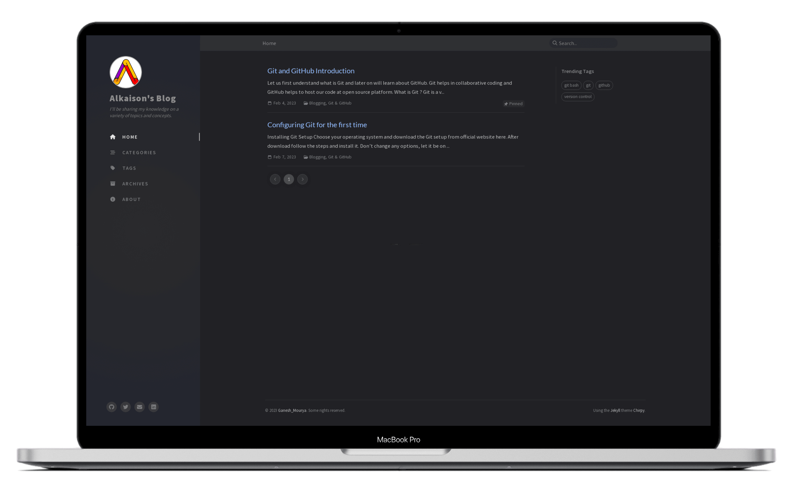

  <h1>Alkaison's Blog</h1>
  <h3 style="font-size:20px;">I'll be sharing my knowledge on a variety of topics and concepts.</h3>
  <h4><a href="https://alkaison.github.io" style="font-size:17.5px;">Visit Blog »</a></h4>
  <!-- Created from Site: https://responsivemockups.com/ -->
  

## Features

- Dark Theme Mode
- Localized UI language
- Pinned Posts
- Hierarchical Categories
- Trending Tags
- Table of Contents
- Last Modified Date of Posts
- Syntax Highlighting
- Mathematical Expressions
- Mermaid Diagram & Flowchart
- Dark Mode Images
- Embed Videos
- Search
- SEO & Performance Optimization

## Credits

This theme is mainly built with [Jekyll](https://jekyllrb.com/) ecosystem, [Bootstrap](https://getbootstrap.com/), [Font Awesome](https://fontawesome.com/) and some other wonderful tools (their copyright information can be found in the relevant files). The avatar and favicon design come from [Clipart Max](https://www.clipartmax.com/middle/m2i8b1m2K9Z5m2K9_ant-clipart-childrens-ant-cute/).

:tada: Thanks to [Cotes](https://github.com/cotes2020) for making this amazing theme [Jekyll-Chirpy](https://github.com/cotes2020/jekyll-theme-chirpy/) for blog sites. 

:tada: Thanks to all the volunteers who contributed to this project, their GitHub IDs are on [this list](https://github.com/cotes2020/jekyll-theme-chirpy/graphs/contributors). Also, I won't forget those guys who submitted the issues or unmerged PR because they reported bugs, shared ideas, or inspired me to write more readable documentation.

Last but not least, thank [JetBrains](https://www.jetbrains.com/?from=jekyll-theme-chirpy) for providing the OSS development license.

## License

This work is published under [MIT](https://github.com/Alkaison/Alkaison.github.io/blob/main/LICENSE) License.
